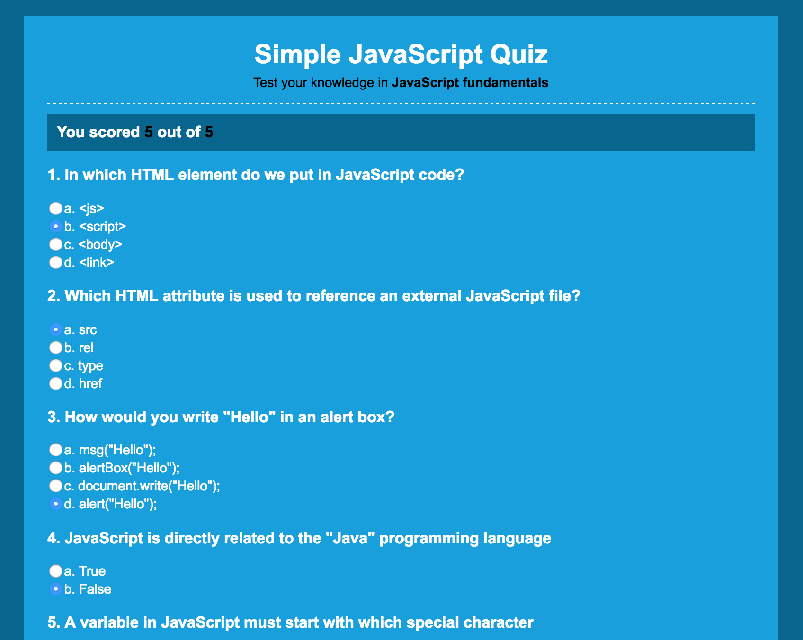

# Simple JavaScript Quiz

In this project, we will learn how to build a single page quiz application using JavaScript. We build a 5 questions quiz of multiple choice.

Once all questions answered, user is required to submit answers. Form validation will be performed and questions are evaluated. At the end, the page will show scoring results.

[View demo site here.](https://webdevtuts.github.io/simple_javascript_quiz/)

